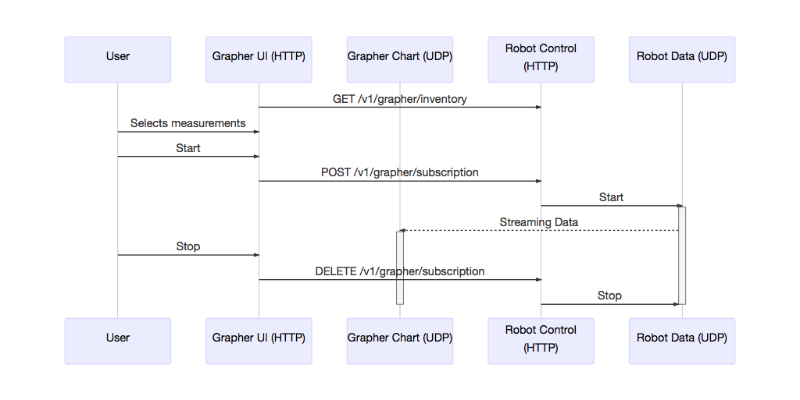

# Telemetry API

Status: **DRAFT**

This is the current state of the Third Coast Telemetry protocol between our grapher app written in LabView and our robot code written in Java.

## Network

The grapher and robot communicate over two network channels, one for control and one for data.

The control channel is a HTTP REST web service that listens on robot TCP port 5800.

The data channel is for one-way graph data streaming from robot to grapher and listens on grapher workstation UDP port 5555.

## Web Service Endpoints

- **`GET /v1/grapher/inventory`** - request the robot inventory, robot web service returns JSON message specified as Inventory Message below
- **`POST /v1/grapher/subscription`** - subscribe and start the data stream, subscribe JSON message sent to robot is specified as Subscribe Message below. The POST request will receive a Subscription Acknowledgement message. Data is streamed over UDP in the JSON Data Message format below.
- **`DELETE /v1/grapher/subscription`** - stop the data stream from robot to grapher.

## Interaction Diagram



## Message Formats

### Inventory Message

This message lists all items that can be graphed under the "items" key and measurements for different types of items under the "measures" key. This messages is versions to potentially invalidate grapher save files.

```json
{
  "items": [
    {
      "id": 0,
      "type": "talon",
      "description": "Azimuth 0 (0)"
    },
    {
      "id": 10,
      "type": "talon",
      "description": "Drive 0 (10)"
    }
  ],
  "measures": {
    "talon": [
      {
        "id": 0,
        "description": "Setpoint",
        "units": "RPM"
      },
      {
        "id": 1,
        "description": "Output Current",
        "units": "amps"
      },
      {
        "id": 2,
        "description": "Output Voltage",
        "units": "volts"
      },
      {
        "id": 3,
        "description": "Encoder Position",
        "units": "revolutions"
      },
      {
        "id": 4,
        "description": "Encoder Velocity",
        "units": "RPM"
      },
      {
        "id": 5,
        "description": "Absolute Encoder Position",
        "units": "revolutions"
      },
      {
        "id": 6,
        "description": "Control Loop Error",
        "units": "RPM"
      },
      {
        "id": 7,
        "description": "Integrator Accumulator",
        "units": "none"
      },
      {
        "id": 8,
        "description": "Bus Voltage",
        "units": "volts"
      },
      {
        "id": 9,
        "description": "Forward Hard Limit Closed",
        "units": "boolean"
      },
      {
        "id": 10,
        "description": "Reverse Hard Limit Closed",
        "units": "boolean"
      },
      {
        "id": 11,
        "description": "Forward Soft Limit OK",
        "units": "boolean"
      },
      {
        "id": 12,
        "description": "Reverse Soft Limit OK",
        "units": "boolean"
      }
    ]
  },
  "timestamp": 1506990773465,
  "type": "inventory",
  "version": 1
}
```

### Subscribe Message

The "itemId" and "measurementId" keys correspond to "id" in the inventory message.

```json
{
  "type": "start",
  "subscription": [
    {
      "itemId": 0,
      "measurementId": 1
    },
    {
      "itemId": 10,
      "measurementId": 2
    },
    {
      "itemId": 1,
      "measurementId": 1
    },
    {
      "itemId": 11,
      "measurementId": 2
    },
    {
      "itemId": 61,
      "measurementId": 13
    },
    {
      "itemId": 62,
      "measurementId": 13
    }
  ]
}
```

### Subscription Acknowledgement

This message is returned as the response to the subscribe message and lists the descriptions of each measurement subscribed to.

```json
{
  "type": "subscription",
  "descriptions": [
    "Shooter Wheel Setpoint",
    "Shooter Wheel Output Current"
  ]
}
```

### Data Message

We want to keep this as lightweight as possible. The "timestamp" and "type" keys might be removed.

```json
{
  "data": [
    0.099998,
    8.52108,
    8.964057,
    1.01418,
    -7.885253,
    -9.401892,
    -2.115742,
    7.151332,
    9.722767,
    3.190984,
    -6.328449,
    -9.922691,
    -4.22653,
    5.426841,
    9.999177,
    5.209498
  ],
  "timestamp": 1507473896981,
  "type": "talon"
}
```

Return to [main page](index).
